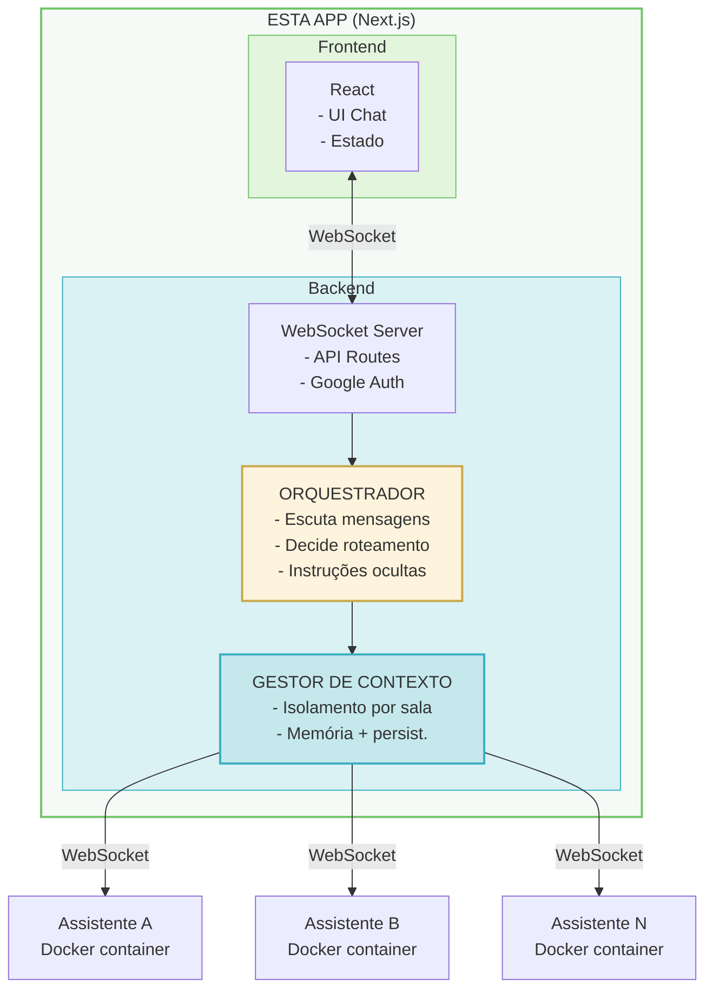

# Plano de Implementação: Multi-LLM Chat

## Visão Geral

Aplicação de chat em tempo real onde múltiplas pessoas conversam com múltiplos assistentes (LLMs personificadas). A aplicação possui um orquestrador interno que gerencia o roteamento de mensagens e envia instruções ocultas aos assistentes.

### Arquitetura

## Decisões Técnicas

| Aspecto | Decisão |
|---------|---------|
| Comunicação tempo real | WebSockets |
| Autenticação | Google OAuth |
| Orquestrador | Módulo interno (não microserviço) |
| Persistência | Híbrida (memória + DB opcional) |
| Tipos de mensagem | Texto, imagens, arquivos (padrão LLM) |
| Comunicação c/ assistentes | WebSocket (MVP) → Message Queue (prod) |
| Isolamento de contexto | Controlado pela app, assistentes stateless |

## Workplan

### Fase 1: Infraestrutura Base ✅
- [x] **1.1** Configurar WebSocket server (Socket.io)
- [x] **1.2** Configurar autenticação Google OAuth (NextAuth.js)
- [x] **1.3** Definir tipos/interfaces base (Mensagem, Sala, Usuário, Assistente)
- [x] **1.4** Criar estrutura de pastas para os novos módulos

### Fase 2: Gestão de Salas ✅
- [x] **2.1** Criar modelo de Sala (em memória)
- [x] **2.2** API: criar sala
- [x] **2.3** API: gerar link de convite
- [x] **2.4** API: entrar em sala via link
- [x] **2.5** API: listar assistentes disponíveis
- [x] **2.6** API: adicionar/remover assistentes da sala

### Fase 3: Sistema de Mensagens ✅
- [x] **3.1** Implementar envio de mensagens (texto)
- [x] **3.2** Implementar recebimento em tempo real
- [x] **3.3** Adicionar suporte a imagens
- [x] **3.4** Adicionar suporte a arquivos
- [x] **3.5** Implementar tipos de visibilidade (pública / oculta-orquestrador)

### Fase 4: Orquestrador ✅
- [x] **4.1** Criar módulo do orquestrador
- [x] **4.2** Implementar listener de mensagens
- [x] **4.3** Implementar lógica de decisão de roteamento
- [x] **4.4** Implementar envio de instruções ocultas para assistentes
- [x] **4.5** Configuração de regras de orquestração por sala

### Fase 5: Gestor de Contexto ✅
- [x] **5.1** Implementar armazenamento de contexto por sala
- [x] **5.2** Implementar isolamento (garantir que sala A não vaza para B)
- [x] **5.3** Implementar preparação de payload para assistentes
- [x] **5.4** Implementar limpeza de contexto (memória)

### Fase 6: Conexão com Assistentes ✅
- [x] **6.1** Criar cliente WebSocket para conectar aos containers
- [x] **6.2** Implementar protocolo de comunicação (request/response)
- [x] **6.3** Implementar reconexão automática
- [x] **6.4** Implementar timeout e retry
- [x] **6.5** Criar mock de assistente para desenvolvimento

### Fase 7: Interface do Usuário ✅
- [x] **7.1** Tela de login (Google)
- [x] **7.2** Tela de listagem de salas
- [x] **7.3** Tela de criar sala + selecionar assistentes
- [x] **7.4** Componente de chat (mensagens)
- [x] **7.5** Componente de input (texto, imagem, arquivo)
- [x] **7.6** Lista de participantes (usuários + assistentes)
- [x] **7.7** Painel de convite (gerar/copiar link)

### Fase 8: Persistência (Opcional)
- [ ] **8.1** Escolher banco de dados (PostgreSQL / SQLite / outro)
- [ ] **8.2** Definir schema (salas, mensagens, usuários)
- [ ] **8.3** Implementar camada de persistência
- [ ] **8.4** Implementar sync memória ↔ banco

### Fase 9: Qualidade & Deploy
- [ ] **9.1** Testes unitários dos módulos core
- [ ] **9.2** Testes de integração WebSocket
- [ ] **9.3** Documentação da API
- [ ] **9.4** Configuração de deploy (Vercel / Docker)

### Fase 10: Assistentes Docker (Ollama) ✅
- [x] **10.1** Documentar arquitetura dos assistentes
- [x] **10.2** Criar docker-compose.assistentes.yml
- [x] **10.3** Implementar cliente Ollama real
- [x] **10.4** Configurar variáveis de ambiente
- [ ] **10.5** Testar integração completa com Ollama

## Notas

### Segurança do Contexto
- Assistentes são **stateless** - não guardam nada entre requests
- Todo contexto é gerenciado pela app
- Cada request pro assistente contém **apenas** dados da sala específica
- O assistente não sabe que outras salas existem

### Mensagens Ocultas
- Orquestrador pode enviar instruções que os usuários não veem
- Formato: `{ tipo: 'instrucao', visibilidade: 'oculta', destino: 'assistente-x', conteudo: '...' }`
- Assistentes respondem normalmente, a app filtra o que exibir

### Próximos Passos (Pós-MVP)
- Migrar comunicação com assistentes para Message Queue (Redis)
- Implementar rate limiting
- Adicionar analytics de uso
- Suporte a múltiplos provedores de auth

---

**Prioridade sugerida para MVP:** Fases 1 → 2 → 3 → 6 (mock) → 7 → 4 → 5

Isso entrega um chat funcional com salas e mock de assistente rapidamente, depois refinamos o orquestrador.
