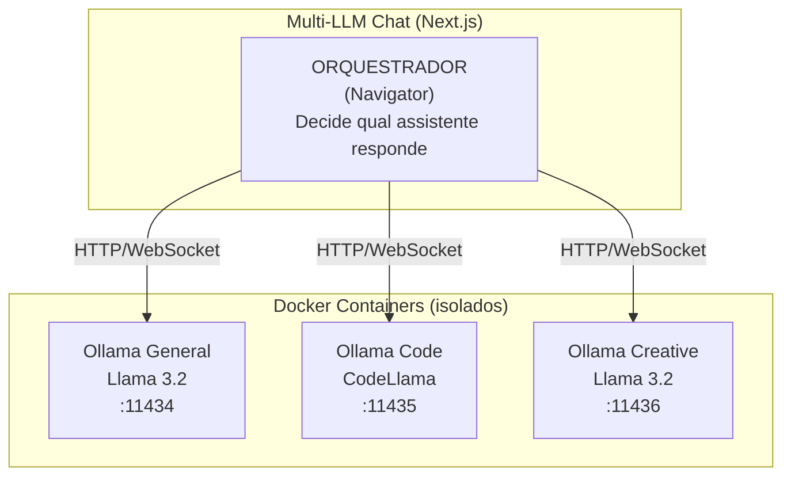

# Assistentes Docker - Guia de Configuração

Este documento descreve como configurar os assistentes LLM que se conectam ao Multi-LLM Chat.

## Arquitetura



## Pré-requisitos

- Docker Desktop instalado
- Apple Silicon (M1/M2/M3) - os containers rodam nativamente em ARM64
- Mínimo 8GB RAM (16GB+ recomendado para modelos maiores)

## Configuração Rápida

### 1. Iniciar Ollama

```bash
# Criar e iniciar o container Ollama
docker run -d \
  --name ollama \
  -p 11434:11434 \
  -v ollama:/root/.ollama \
  ollama/ollama

# Verificar se está rodando
docker logs ollama
```

### 2. Baixar Modelos

```bash
# Modelo geral (recomendado para começar)
docker exec -it ollama ollama pull llama3.2

# Modelo para código
docker exec -it ollama ollama pull codellama

# Modelo leve e rápido
docker exec -it ollama ollama pull mistral

# Modelo criativo
docker exec -it ollama ollama pull neural-chat
```

### 3. Testar Localmente

```bash
# Testar via CLI
docker exec -it ollama ollama run llama3.2 "Olá, como você está?"

# Testar via API
curl http://localhost:11434/api/generate -d '{
  "model": "llama3.2",
  "prompt": "Olá!",
  "stream": false
}'
```

## Docker Compose (Recomendado)

Crie um arquivo `docker-compose.assistentes.yml` na raiz do projeto:

```yaml
services:
  # Assistente Geral
  ollama-geral:
    image: ollama/ollama
    container_name: assistente-geral
    ports:
      - "11434:11434"
    volumes:
      - ollama-geral:/root/.ollama
    environment:
      - OLLAMA_HOST=0.0.0.0
    healthcheck:
      test: ["CMD", "curl", "-f", "http://localhost:11434/api/tags"]
      interval: 30s
      timeout: 10s
      retries: 3
    restart: unless-stopped

  # Assistente de Código (porta diferente)
  ollama-codigo:
    image: ollama/ollama
    container_name: assistente-codigo
    ports:
      - "11435:11434"
    volumes:
      - ollama-codigo:/root/.ollama
    environment:
      - OLLAMA_HOST=0.0.0.0
    restart: unless-stopped

  # Assistente Criativo (porta diferente)
  ollama-criativo:
    image: ollama/ollama
    container_name: assistente-criativo
    ports:
      - "11436:11434"
    volumes:
      - ollama-criativo:/root/.ollama
    environment:
      - OLLAMA_HOST=0.0.0.0
    restart: unless-stopped

volumes:
  ollama-geral:
  ollama-codigo:
  ollama-criativo:
```

### Iniciar os Assistentes

```bash
# Subir todos os containers
docker compose -f docker-compose.assistentes.yml up -d

# Baixar modelos em cada container
docker exec assistente-geral ollama pull llama3.2
docker exec assistente-codigo ollama pull codellama
docker exec assistente-criativo ollama pull neural-chat

# Verificar status
docker compose -f docker-compose.assistentes.yml ps
```

## API do Ollama

### Endpoints Principais

| Endpoint | Método | Descrição |
|----------|--------|-----------|
| `/api/generate` | POST | Gera texto (streaming ou completo) |
| `/api/chat` | POST | Chat com histórico de mensagens |
| `/api/tags` | GET | Lista modelos disponíveis |
| `/api/show` | POST | Informações de um modelo |

### Exemplo: Chat com Histórico

```bash
curl http://localhost:11434/api/chat -d '{
  "model": "llama3.2",
  "messages": [
    { "role": "system", "content": "Você é um assistente prestativo." },
    { "role": "user", "content": "O que é Docker?" }
  ],
  "stream": false
}'
```

### Exemplo: Streaming

```bash
curl http://localhost:11434/api/chat -d '{
  "model": "llama3.2",
  "messages": [
    { "role": "user", "content": "Conte uma história curta" }
  ],
  "stream": true
}'
```

## Integração com Multi-LLM Chat

### Atualizar Configuração dos Assistentes

Edite `src/services/assistentes/gerenciador-assistentes.ts`:

```typescript
const assistentesMock: Assistente[] = [
  {
    id: 'assistente-geral',
    nome: 'Assistente Geral',
    descricao: 'Assistente de propósito geral (Llama 3.2)',
    avatarUrl: '/avatars/assistente-geral.png',
    endpoint: 'http://localhost:11434',
    modelo: 'llama3.2',
    status: 'online',
  },
  {
    id: 'assistente-codigo',
    nome: 'Especialista em Código',
    descricao: 'Ajuda com programação (CodeLlama)',
    avatarUrl: '/avatars/assistente-codigo.png',
    endpoint: 'http://localhost:11435',
    modelo: 'codellama',
    status: 'online',
  },
  {
    id: 'assistente-criativo',
    nome: 'Assistente Criativo',
    descricao: 'Escrita criativa e brainstorming',
    avatarUrl: '/avatars/assistente-criativo.png',
    endpoint: 'http://localhost:11436',
    modelo: 'neural-chat',
    status: 'online',
  },
]
```

### Cliente HTTP para Ollama

Crie `src/services/assistentes/cliente-ollama.ts`:

```typescript
import type {
  AssistenteId,
  PayloadParaAssistente,
  RespostaAssistente,
} from '@/types'

interface OllamaMensagem {
  role: 'system' | 'user' | 'assistant'
  content: string
}

interface OllamaResposta {
  message: {
    role: string
    content: string
  }
  done: boolean
}

export async function enviarParaOllama(
  endpoint: string,
  modelo: string,
  payload: PayloadParaAssistente
): Promise<RespostaAssistente> {
  // Converter mensagens para formato Ollama
  const mensagens: OllamaMensagem[] = []

  // Adicionar instrução oculta como system message
  if (payload.instrucaoOculta) {
    mensagens.push({
      role: 'system',
      content: payload.instrucaoOculta,
    })
  }

  // Converter histórico
  for (const msg of payload.mensagens) {
    const conteudoTexto = msg.conteudo
      .filter((c) => c.tipo === 'texto')
      .map((c) => (c as { texto: string }).texto)
      .join('\n')

    if (conteudoTexto) {
      mensagens.push({
        role: msg.tipoRemetente === 'usuario' ? 'user' : 'assistant',
        content: conteudoTexto,
      })
    }
  }

  // Chamar API do Ollama
  const resposta = await fetch(`${endpoint}/api/chat`, {
    method: 'POST',
    headers: { 'Content-Type': 'application/json' },
    body: JSON.stringify({
      model: modelo,
      messages: mensagens,
      stream: false,
    }),
  })

  if (!resposta.ok) {
    throw new Error(`Erro ao chamar Ollama: ${resposta.statusText}`)
  }

  const dados: OllamaResposta = await resposta.json()

  return {
    salaId: payload.salaId,
    assistenteId: payload.assistenteId,
    conteudo: [{ tipo: 'texto', texto: dados.message.content }],
  }
}
```

## Modelos Recomendados

### Para Apple Silicon (M1/M2/M3)

| Modelo | Tamanho | RAM Mín. | Uso |
|--------|---------|----------|-----|
| `llama3.2` | 2GB | 4GB | Geral, rápido |
| `llama3.2:3b` | 2GB | 4GB | Geral, muito rápido |
| `llama3.1:8b` | 4.7GB | 8GB | Geral, melhor qualidade |
| `codellama` | 3.8GB | 8GB | Código |
| `codellama:13b` | 7.4GB | 16GB | Código, melhor qualidade |
| `mistral` | 4.1GB | 8GB | Geral, bom balanço |
| `neural-chat` | 4.1GB | 8GB | Conversação |
| `qwen2.5-coder` | 4.7GB | 8GB | Código (excelente) |

### Baixar Modelos Adicionais

```bash
# Ver modelos disponíveis
docker exec -it ollama ollama list

# Baixar novo modelo
docker exec -it ollama ollama pull qwen2.5-coder

# Remover modelo (liberar espaço)
docker exec -it ollama ollama rm modelo-antigo
```

## Troubleshooting

### Container não inicia
```bash
# Ver logs
docker logs ollama

# Reiniciar
docker restart ollama
```

### Modelo muito lento
- Use modelo menor (ex: `llama3.2:3b` ao invés de `llama3.1:70b`)
- Verifique RAM disponível: `docker stats`

### Erro de conexão
```bash
# Verificar se API está respondendo
curl http://localhost:11434/api/tags

# Verificar rede Docker
docker network ls
```

### Limpar cache de modelos
```bash
# Remover volume (apaga todos os modelos baixados)
docker volume rm ollama

# Recriar container
docker run -d --name ollama -p 11434:11434 -v ollama:/root/.ollama ollama/ollama
```

## Próximos Passos

1. [ ] Implementar cliente real Ollama no Multi-LLM Chat
2. [ ] Adicionar health check para status dos assistentes
3. [ ] Implementar streaming de respostas
4. [ ] Criar UI para gerenciar modelos/assistentes
5. [ ] Adicionar suporte a imagens (modelos multimodais)
