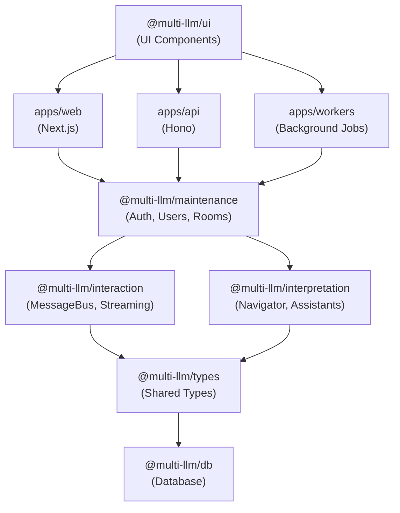
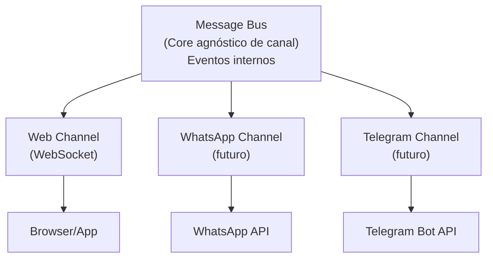

# Refatoração: Arquitetura em 3 Camadas + Monorepo

## Status: EM PROGRESSO 🚧

**Última atualização:** 2026-04-03  
**Progresso geral:** ~70% completo

---

## Objetivo

Reorganizar o código em:
1. **Monorepo com Turborepo** - apps/ + packages/
2. **3 camadas bem definidas** como packages compartilhados

---

## Requisitos Confirmados

- ✅ **Streaming** token por token (como ChatGPT)
- ✅ **Navegador invisível** - decisões não aparecem no chat (exceto modo debug)
- ✅ **Sequencial** - navegador pode chamar múltiplos assistentes em sequência, bloqueando input do usuário
- ✅ **Multi-canal** - arquitetura preparada para futuros conectores (WhatsApp, Telegram, Messenger, etc.)
- ✅ **Monorepo** - Turborepo com apps/ + packages/
- ✅ **Apps** - web (Next.js) + api (backend separado) + workers (background jobs)

---

## Progresso

### Fase 0: Setup Monorepo ✅
- [x] Instalar Turborepo
- [x] Criar estrutura de pastas
- [x] Configurar turbo.json
- [x] Atualizar pnpm-workspace.yaml
- [x] Mover código para apps/web

### Fase 1: Packages ✅
- [x] @multi-llm/types - Tipos compartilhados (criado)
- [x] @multi-llm/interaction - Camada de Interação (implementado)
  - [x] message-store.ts
  - [x] message-bus.ts
  - [x] stream-handler.ts
  - [x] channel.ts + channel-manager.ts
- [x] @multi-llm/interpretation - Camada de Interpretação (implementado)
  - [x] navigator.ts
  - [x] llm-router.ts
  - [x] routing-rules.ts
  - [x] ollama-adapter.ts
  - [x] registry.ts
  - [x] context-builder.ts
- [x] @multi-llm/maintenance - Camada de Manutenção (implementado)
  - [x] room-manager.ts
  - [x] user-manager.ts
  - [x] session.ts
  - [x] feature-flags.ts
- [ ] @multi-llm/db - Database (quando adicionar)
- [ ] @multi-llm/ui - Componentes UI (extrair depois)

### Fase 2: Apps ✅
- [x] apps/web - Next.js (código migrado, usando packages)
  - [x] Estrutura de pastas criada
  - [x] Integrando com @multi-llm/interpretation
  - [x] Integrando com @multi-llm/interaction
  - [x] Integrando com @multi-llm/maintenance
  - [x] Services legados ainda presentes (migração em andamento)
- [x] apps/api - Hono (estrutura básica criada)
  - [x] package.json configurado
  - [x] index.ts básico
  - [ ] Rotas REST ainda não implementadas
- [x] apps/workers - Background jobs (placeholder criado)
  - [x] package.json configurado
  - [x] index.ts básico
  - [ ] Jobs ainda não implementados

### Fase 3: Integração (EM ANDAMENTO) 🔄
- [x] apps/web está usando packages via imports
  - [x] @multi-llm/types integrado
  - [x] @multi-llm/interaction integrado parcialmente
  - [x] @multi-llm/interpretation integrado nas API routes
  - [x] @multi-llm/maintenance integrado
- [ ] Migrar services/ restantes de apps/web para packages
  - [ ] apps/web/src/services/assistants → já está em packages
  - [ ] apps/web/src/services/context → já está em packages
  - [ ] apps/web/src/services/messages → parcialmente migrado
  - [ ] apps/web/src/services/orchestrator → renomeado para navigator
  - [ ] apps/web/src/services/rooms → já está em packages
  - [ ] apps/web/src/services/websocket → mover para @multi-llm/interaction
- [ ] Conectar camadas via Message Bus completo
- [ ] Implementar streaming token-por-token real

---

## Estrutura do Monorepo

```
multi-llm-chat/
├── apps/
│   ├── web/                      # Next.js - Frontend + SSR
│   │   ├── src/
│   │   │   ├── app/              # App Router pages
│   │   │   ├── components/       # UI components
│   │   │   └── hooks/            # React hooks
│   │   ├── package.json
│   │   └── next.config.ts
│   │
│   ├── api/                      # Backend API (Hono/Fastify/Express)
│   │   ├── src/
│   │   │   ├── routes/           # API routes
│   │   │   ├── middleware/       # Auth, logging, etc.
│   │   │   └── index.ts
│   │   └── package.json
│   │
│   └── workers/                  # Background jobs
│       ├── src/
│       │   ├── jobs/             # Job definitions
│       │   │   ├── process-message.ts
│       │   │   └── cleanup.ts
│       │   └── index.ts
│       └── package.json
│
├── packages/
│   ├── interaction/              # CAMADA DE INTERAÇÃO
│   │   ├── src/
│   │   │   ├── channels/         # Abstração multi-canal
│   │   │   │   ├── channel.ts
│   │   │   │   ├── channel-manager.ts
│   │   │   │   └── web-channel.ts
│   │   │   ├── chat/
│   │   │   │   ├── message-store.ts
│   │   │   │   ├── message-bus.ts
│   │   │   │   └── stream-handler.ts
│   │   │   └── index.ts
│   │   └── package.json          # @multi-llm/interaction
│   │
│   ├── interpretation/           # CAMADA DE INTERPRETAÇÃO
│   │   ├── src/
│   │   │   ├── navigator/
│   │   │   │   ├── navigator.ts
│   │   │   │   ├── routing-rules.ts
│   │   │   │   └── llm-router.ts
│   │   │   ├── assistants/
│   │   │   │   ├── registry.ts
│   │   │   │   └── ollama-adapter.ts
│   │   │   ├── context/
│   │   │   │   └── context-builder.ts
│   │   │   └── index.ts
│   │   └── package.json          # @multi-llm/interpretation
│   │
│   ├── maintenance/              # CAMADA DE MANUTENÇÃO
│   │   ├── src/
│   │   │   ├── auth/
│   │   │   │   └── session.ts
│   │   │   ├── users/
│   │   │   │   └── user-manager.ts
│   │   │   ├── rooms/
│   │   │   │   └── room-manager.ts
│   │   │   ├── config/
│   │   │   │   └── feature-flags.ts
│   │   │   └── index.ts
│   │   └── package.json          # @multi-llm/maintenance
│   │
│   ├── types/                    # Tipos compartilhados
│   │   ├── src/
│   │   │   └── index.ts
│   │   └── package.json          # @multi-llm/types
│   │
│   ├── db/                       # Database client + migrations
│   │   ├── src/
│   │   │   ├── client.ts
│   │   │   ├── schema.ts
│   │   │   └── index.ts
│   │   ├── drizzle/              # Migrations
│   │   └── package.json          # @multi-llm/db
│   │
│   └── ui/                       # Componentes UI compartilhados
│       ├── src/
│       │   ├── button.tsx
│       │   ├── input.tsx
│       │   └── index.ts
│       └── package.json          # @multi-llm/ui
│
├── tooling/                      # Configs compartilhadas
│   ├── eslint/
│   ├── typescript/
│   └── biome/
│
├── turbo.json                    # Turborepo config
├── pnpm-workspace.yaml
├── package.json
└── .github/
    └── plans/
```

---

## Apps

### web (Next.js)

Frontend + Server Components. Consome packages.

```typescript
// apps/web/src/app/chat/page.tsx
import { MessageBus } from '@multi-llm/interaction'
import { RoomManager } from '@multi-llm/maintenance'
```

### api (Backend)

API REST/WebSocket separada. Opções de framework:
- **Hono** (leve, edge-ready)
- **Fastify** (rápido, plugins)
- **Express** (familiar)

```typescript
// apps/api/src/routes/chat.ts
import { Navigator } from '@multi-llm/interpretation'
import { StreamHandler } from '@multi-llm/interaction'
```

### workers (Background Jobs)

Processamento assíncrono. Opções:
- **BullMQ** (Redis-based)
- **Trigger.dev** (serverless)
- **Inngest** (event-driven)

```typescript
// apps/workers/src/jobs/process-message.ts
import { AssistantAdapter } from '@multi-llm/interpretation'
```

---

## Packages (3 Camadas)

### @multi-llm/interaction

```typescript
// Exports
export { MessageBus, type ChatEvent } from './chat/message-bus'
export { StreamHandler } from './chat/stream-handler'
export { MessageStore } from './chat/message-store'
export { Channel, ChannelManager } from './channels'
export { WebChannel } from './channels/web-channel'
```

### @multi-llm/interpretation

```typescript
// Exports
export { Navigator, type RoutingPlan } from './navigator'
export { AssistantRegistry } from './assistants/registry'
export { OllamaAdapter } from './assistants/ollama-adapter'
export { ContextBuilder } from './context'
```

### @multi-llm/maintenance

```typescript
// Exports
export { SessionManager } from './auth'
export { UserManager } from './users'
export { RoomManager } from './rooms'
export { FeatureFlags } from './config'
```

---

## Diagrama de Dependências



---

## Workplan

### Fase 0: Setup Monorepo ✅
- [x] Instalar Turborepo
- [x] Configurar pnpm-workspace.yaml
- [x] Criar estrutura de pastas (apps/ + packages/ + tooling/)
- [x] Configurar turbo.json (pipelines: build, dev, lint, check, test, typecheck)
- [x] Mover configs compartilhadas para tooling/

### Fase 1: Extrair Packages ✅
- [x] Criar @multi-llm/types
- [ ] Criar @multi-llm/db (adiado - sem DB ainda)
- [x] Extrair código existente para packages das 3 camadas

### Fase 2: Camada de Interação (@multi-llm/interaction) ✅
- [x] Criar interface `Channel` base
- [x] Criar `channel-manager.ts`
- [ ] Criar `web-channel.ts` (pendente - usar WebSocket)
- [x] Criar `message-bus.ts`
- [x] Criar `stream-handler.ts`
- [x] Criar `message-store.ts`

### Fase 3: Camada de Interpretação (@multi-llm/interpretation) ✅
- [x] Renomear "orchestrator" → "navigator"
- [x] Criar `navigator.ts` com interface clara
- [x] Separar `routing-rules.ts` do LLM
- [x] Criar `llm-router.ts` para roteamento via LLM
- [x] Criar `ollama-adapter.ts` (streaming parcial)
- [x] Criar `registry.ts` para gerenciar assistentes
- [x] Criar `context-builder.ts` para preparar contexto

### Fase 4: Camada de Manutenção (@multi-llm/maintenance) ✅
- [x] Extrair `room-manager.ts`
- [x] Criar `user-manager.ts`
- [x] Organizar auth (session.ts)
- [x] Criar `feature-flags.ts`

### Fase 5: Apps (PARCIAL) 🔄
- [x] Refatorar apps/web para usar packages (em andamento - 70%)
  - [x] API routes usando packages
  - [x] Tipos usando @multi-llm/types
  - [ ] Remover services legados duplicados
- [x] Criar apps/api (Hono - estrutura básica)
  - [ ] Implementar rotas REST
  - [ ] Mover lógica de WebSocket de apps/web
- [x] Criar apps/workers (estrutura criada)
  - [ ] Implementar jobs de background

### Fase 6: Integração (PRÓXIMO) 🎯
- [x] Conectar as 3 camadas (básico funcionando)
- [ ] Testar fluxo completo com streaming token-por-token
- [ ] Mover WebSocket de apps/web para apps/api
- [ ] Implementar MessageBus completo entre camadas
- [ ] Garantir isolamento real entre canais

### Fase 7: Cleanup (PENDENTE)
- [ ] Remover código legado de apps/web/src/services
- [ ] Remover duplicação entre packages e apps/web
- [ ] Atualizar documentação
- [ ] Rodar biome check em todos packages
- [ ] Remover dependências não utilizadas

---

## Configuração Turborepo

```json
// turbo.json
{
  "$schema": "https://turbo.build/schema.json",
  "tasks": {
    "build": {
      "dependsOn": ["^build"],
      "outputs": ["dist/**", ".next/**"]
    },
    "dev": {
      "cache": false,
      "persistent": true
    },
    "lint": {
      "dependsOn": ["^lint"]
    },
    "check": {
      "dependsOn": ["^check"]
    },
    "test": {
      "dependsOn": ["^build"]
    }
  }
}
```

```yaml
# pnpm-workspace.yaml
packages:
  - "apps/*"
  - "packages/*"
  - "tooling/*"
```

---

## Abstração Multi-Canal



### Interface Channel

```typescript
interface Channel {
  readonly id: string
  readonly type: ChannelType
  
  connect(): Promise<void>
  disconnect(): Promise<void>
  onMessage(handler: (msg: IncomingMessage) => void): void
  send(msg: OutgoingMessage): Promise<void>
  
  supportsStreaming(): boolean
  sendToken?(messageId: string, token: string): Promise<void>
}

type ChannelType = 'web' | 'whatsapp' | 'telegram' | 'messenger' | 'slack'
```

---

## Interfaces Principais

### @multi-llm/interaction

```typescript
interface MessageBus {
  publish(event: ChatEvent): void
  subscribe(handler: (event: ChatEvent) => void): () => void
}

type ChatEvent =
  | { type: 'user-message'; message: Message }
  | { type: 'assistant-start'; assistantId: string; messageId: string }
  | { type: 'assistant-token'; messageId: string; token: string }
  | { type: 'assistant-end'; messageId: string }
  | { type: 'assistant-error'; messageId: string; error: string }

interface StreamHandler {
  startStream(roomId: string, assistantId: string): string
  pushToken(messageId: string, token: string): void
  endStream(messageId: string): void
}
```

### @multi-llm/interpretation

```typescript
interface Navigator {
  route(message: Message, context: ConversationContext): Promise<RoutingPlan>
}

interface RoutingPlan {
  assistants: AssistantId[]
  reasoning: string
  shouldBlock: boolean
}

interface AssistantAdapter {
  streamResponse(
    assistantId: AssistantId,
    prompt: string,
    context: Message[],
    onToken: (token: string) => void
  ): Promise<void>
}
```

### @multi-llm/maintenance

```typescript
interface FeatureFlags {
  isDebugMode(userId: string): boolean
  canSeeNavigatorDecisions(userId: string): boolean
}
```

---

## Assistentes Configurados

| ID                   | Nome              | Modelo        | Porta  |
|---------------------|-------------------|---------------|--------|
| general-assistant   | General Assistant | llama3.2      | 11434  |
| code-assistant      | Code Assistant    | codellama:7b  | 11435  |
| creative-assistant  | Creative Assistant| llama3.2      | 11436  |
| navigator           | (interno)         | llama3.2      | 11430  |
