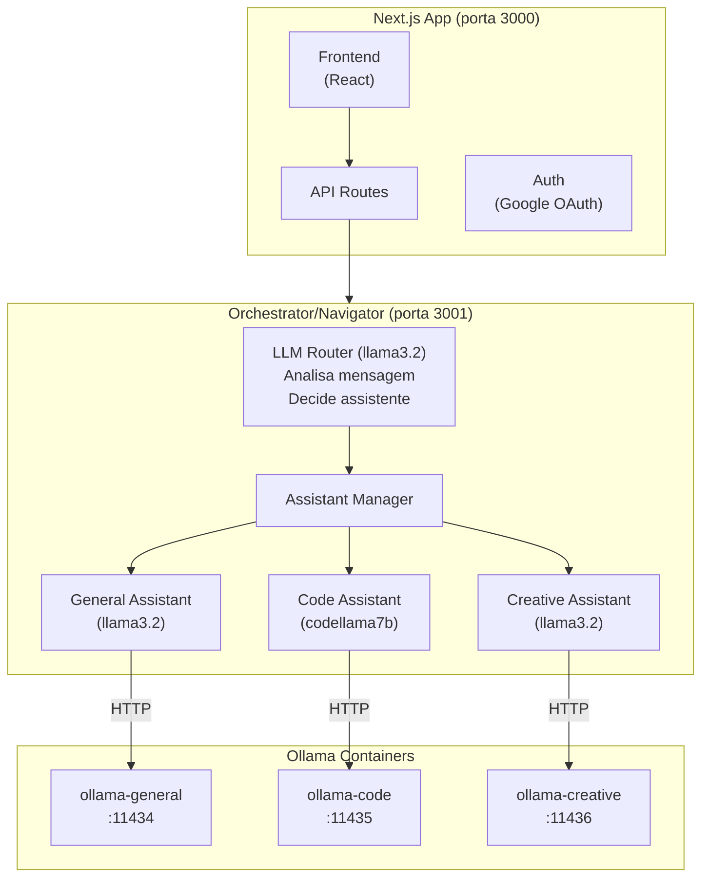

# Plano de Implementação: Multi-LLM Chat

## Visão Geral

Aplicação de chat em tempo real onde múltiplas pessoas conversam com múltiplos assistentes (LLMs personificadas). O **orquestrador é uma LLM** que analisa cada mensagem e decide qual assistente especialista deve responder.

### Arquitetura



## Decisões Técnicas

| Aspecto | Decisão |
|---------|---------|
| Comunicação tempo real | WebSockets |
| Autenticação | Google OAuth |
| Orquestrador | **LLM (llama3.2) em Docker separado** |
| Roteamento | LLM analisa mensagem e decide qual assistente |
| Persistência | Híbrida (memória + DB opcional) |
| Tipos de mensagem | Texto, imagens, arquivos |
| Comunicação c/ assistentes | HTTP para Ollama API |

## Workplan

### Fase 1: Infraestrutura Base ✅
- [x] Configurar WebSocket server (Socket.io)
- [x] Configurar autenticação Google OAuth (NextAuth.js)
- [x] Definir tipos/interfaces base
- [x] Criar estrutura de pastas

### Fase 2: Gestão de Salas ✅
- [x] Criar modelo de Sala (em memória)
- [x] APIs de salas e convites
- [x] Listar assistentes disponíveis

### Fase 3: Sistema de Mensagens ✅
- [x] Envio/recebimento de mensagens
- [x] Suporte a texto, imagens, arquivos
- [x] Tipos de visibilidade

### Fase 4: Orquestrador como LLM ✅
- [x] Criar serviço Docker separado (Fastify)
- [x] **LLM analisa mensagem e decide roteamento**
- [x] Retorna JSON: `{"assistants": [...], "reasoning": "..."}`
- [x] Chama assistentes selecionados
- [x] Retorna respostas para Next.js

### Fase 5: Gestor de Contexto ✅
- [x] Armazenamento de contexto por sala
- [x] Isolamento entre salas
- [x] Preparação de payload

### Fase 6: Conexão com Assistentes ✅
- [x] Cliente HTTP para Ollama
- [x] 3 containers: general, code, creative
- [x] docker-compose.yml configurado

### Fase 7: Interface do Usuário ✅
- [x] Login (Google)
- [x] Listagem e criação de salas
- [x] Chat com mensagens
- [x] Participantes e convites

### Fase 8: Persistência (Pendente)
- [ ] Banco de dados
- [ ] Schema e camada de persistência

### Fase 9: Qualidade & Deploy (Pendente)
- [ ] Testes
- [ ] Documentação
- [ ] Deploy

## Como Executar

```bash
# 1. Subir todos os containers (Ollama + Orchestrator)
docker compose up -d --build

# 2. Baixar os modelos (primeira vez)
docker exec assistant-general ollama pull llama3.2
docker exec assistant-code ollama pull codellama:7b
docker exec assistant-creative ollama pull llama3.2

# 3. Rodar o Next.js
pnpm dev

# 4. Acessar http://localhost:3000
```

## Fluxo de Mensagem

1. **Usuário** envia mensagem no chat
2. **Next.js** recebe via API e envia para Orchestrator
3. **Orchestrator (LLM)** analisa a mensagem:
   - "Isso é sobre código? → code-assistant"
   - "Isso é criativo? → creative-assistant"
   - "Geral? → general-assistant"
4. **Orchestrator** chama o(s) assistente(s) selecionado(s)
5. **Respostas** voltam para Next.js e são salvas/exibidas
